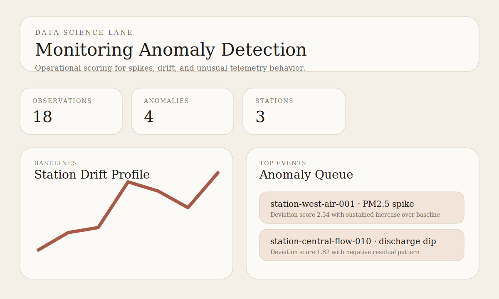

# Monitoring Anomaly Detection

Data science portfolio project for detector comparison, labeled-event evaluation, ranking suspicious sensor events, and packaging triage-ready anomaly reports.



## Snapshot

- Lane: Data science and anomaly detection
- Domain: Monitoring telemetry triage
- Stack: Python, CSV fixtures, lightweight anomaly-detection experiment workflow
- Includes: labeled sample observations, detector leaderboard, ranked events, station-level summaries, tests

## Overview

This project shows the operational side of data science: turning raw monitoring telemetry into anomaly candidates that an analyst or downstream alerting system can review quickly.

The current implementation stays public-safe and dependency-light. It uses checked-in observations, compares several detector strategies against labeled events, selects the strongest detector by F1 score, and exports a ranked anomaly report with experiment-style metadata.

## What It Demonstrates

- Candidate-detector comparison across global, rolling, robust, and delta-based scoring
- An object-oriented anomaly workflow that can be extended without changing the public export interface
- Labeled-event evaluation with precision, recall, and F1
- Station-level baselines and ranked event review
- A clean handoff artifact for alerting, dashboards, or analyst queues

## Project Structure

```text
monitoring-anomaly-detection/
|-- data/
|   `-- station_observations.csv
|-- src/monitoring_anomaly_detection/
|   |-- __init__.py
|   `-- pipeline.py
|-- tests/
|   `-- test_pipeline.py
|-- assets/
|   `-- anomaly-preview.svg
|-- docs/
|   |-- architecture.md
|   `-- demo-storyboard.md
|-- outputs/
|   `-- .gitkeep
|-- pyproject.toml
`-- README.md
```

## Quick Start

```bash
pip install -e .[dev]
python -m monitoring_anomaly_detection.pipeline
```

Run tests:

```bash
pytest
```

## Current Output

The default command writes `outputs/anomaly_report.json` with:

- experiment run metadata and detector thresholds
- a persisted `outputs/run_registry.json` entry for each export
- station baselines
- detector leaderboard entries and labeled-event metrics
- ranked scored events
- selected alerts from the winning detector
- per-station alert counts
- operational notes for triage

See [docs/architecture.md](docs/architecture.md) for the design notes.
See [docs/demo-storyboard.md](docs/demo-storyboard.md) for the reviewer walkthrough.